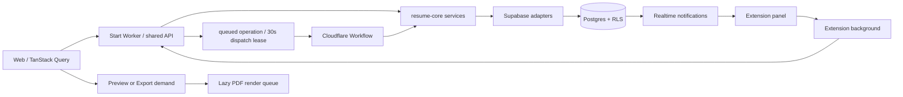

# 请求与性能优化实施记录

日期：2026-09-25。范围：现有 Start Worker、Supabase、独立 Extension。未拆分 API Worker，未发布生产环境。

## 实现结构



- 简历分页：每页 30 条，加 1 条判断下一页；`updated_at DESC, id DESC` 游标；仅首屏请求精确总数。版本分页按 `version_no DESC`，同样每页 30 条。翻页不读取版本正文。
- `GET /api/v1/resumes/page` 和 `GET /api/v1/resumes/{id}/summary` 为 Web 与 Extension 共用契约。旧完整列表接口保留。SSR 通过同一 router 直接调用，避免绕回 HTTP。
- Web 的侧栏、仪表盘、打开简历、导入选择器及版本面板使用无限查询。重命名、创建、删除、恢复、接受建议等相关失效操作先取消进行中的分页请求、保留首屏，再刷新。关闭工作区资源也重置相关列表。已有自动保存仍由 session 管理。
- 工作区标签、侧栏当前简历、记住的基础简历可按 ID 获取摘要，不依赖其是否位于首屏。
- 简历路由的关键路径只等待简历；助手挂载后独立加载会话和技能，再加载历史。会话 ID 在 effect 中接入已有 session，不重建编辑内容或撤销栈。
- 隐藏预览且未打开导出时不启动 PDF 渲染。300ms 合并输入，同一队列只运行一个任务；过期任务结果丢弃。旧 blob 可用于过渡显示，但过期时禁止下载，状态栏显示 `Pages not measured`。旧页数由 stale 标记屏蔽；撤销回到同一缓存输入时可以复用。独立 `check_fit` 保持不变。
- Extension 首屏由 snapshot 提供，翻页消息不再读取职位。已记住的基础简历缺席首屏时按 ID 验证；已删除的记忆会被清除。成功操作取消旧刷新并采用返回 snapshot，失败仍刷新。Realtime 通知合并 150ms，断线后每 10 秒刷新；租约到期及任务 deadline 另有恢复定时器，刷新失败后每 30 秒重试。未变化的首屏刷新保留已加载的后续页。

## 搜索与数据库边界

新增两个兼容迁移：

1. `20260925120000_request_performance.sql`：存储生成列自动回填搜索文本，数据写入时维护；标题使用表达式索引。增加 trigram、简历游标、AI 运行时间索引，以及配额聚合、职位读取和派发租约 RPC。
2. `20260925121000_search_candidate_index.sql`：解决 PostgreSQL 的 RLS 安全屏障阻止普通 LIKE 使用 trigram 索引的问题。

`private.resume_search_ids` 使用固定 search_path，身份只从 `auth.uid()` 取得，显式限制 `user_id`，仅返回候选 ID 和时间。它是 SECURITY DEFINER，不能接受任意用户 ID，匿名不可执行，private schema 不暴露给 PostgREST。外层 `resume_search_candidates` 是 SECURITY INVOKER，重新通过 RLS 读取文档。跨账号和匿名访问均有 SQL 测试。

候选查询每次最多 51 行，服务处理 50 行后继续游标。标题任一词匹配优先，正文仍要求所有词可跨字段匹配。最终筛选、摘要和高亮继续使用原有 `matchTokens` / `matchDocument`，最多返回 20 份简历。短词、标点及不能保证 SQL/JavaScript 大小写行为一致的情况保守回退；含非 ASCII 的候选保留给 JavaScript 判断，因此正确性不会依赖数据库 locale。

常见已绑定职位读取仅一个只读 RPC，包含绑定、操作和简历有效性。历史任务状态从 agent_runs 只读推导；首次查询无绑定的旧记录仍执行收养。仅过期操作做协调，旧任务重试前才持久化推导状态。正常 running/terminal 查询不请求 Workflow 状态。queued 任务原子取得 30 秒租约后才检查或创建同 ID Workflow。

AI 配额预检查返回 `{count, oldest}`，不再传输所有运行时间。数据库 advisory lock 和准入触发器仍是并发配额的最终保障。

## 本地对比

环境：本地 Supabase / PostgreSQL 17.6。使用独立随机用户、1,000 份约 15 KB 的合成简历，以及同一简历的 1,000 个版本。10 份正文包含指定稀有关键词。SQL benchmark 在事务末尾回滚，未读取真实用户正文。

下表是数据库 JSON 聚合后的未压缩字节数，用于比较数据库到 Worker 的数据量，不包含 HTTP 头、协议包装、首屏 count 元数据及网络压缩。基线为原全量查询，优化后为新分页或候选查询；两次生成的时间字符串长度可能略有不同。

| 场景 | 基线 | 优化后 | 降幅 |
| --- | ---: | ---: | ---: |
| 简历摘要首屏 | 152,891 B / 1,000 行 | 4,646 B / 30 行 | 约 97% |
| 稀有关键词文档读取 | 15,474,904 B / 1,000 行 | 154,910 B / 10 候选 | 约 99% |
| 版本摘要首屏 | 144,891 B / 1,000 行 | 4,409 B / 30 行 | 约 97% |

查询计划与单次本地耗时：

- 新简历数据页采用 `resumes_user_cursor` Index Scan，31 行约 0.035ms；独立首屏计数约 0.330ms。原全量列表扫描和排序约 0.449ms。
- 候选匹配分支出现 `resumes_search_text` Bitmap Index Scan。完整候选 RPC 约 1.744ms；10 条候选的 JSON 聚合约 1.328ms。旧全量文档查询本身约 0.498ms，但 1,000 份文档 JSON 聚合约 42.020ms，尚不含传输和 Worker 解析。
- 新版本页采用 `resume_versions_resume_no` Index Scan，31 行约 0.778ms；旧全量版本约 1.141ms。RLS 仍会读取所属简历集合，分页并不消除这部分授权成本。
- benchmark 在批量写入后执行 ANALYZE；优化路径清理 GIN pending list 来测稳定状态。首次批量写入后、不清理 pending list 的候选 RPC 曾约 18ms。生产需要观察 autovacuum、GIN 维护和写入成本。

搜索在没有足够标题命中时通常执行 count、标题候选和正文候选三个数据库请求，原路径是一次全量读取；这是用少量有界查询换取更少文档传输的取舍。

这些是单次本地样本，不是 p95、生产容量或网络延迟承诺。小数据集可能不会得到更短的 SQL 执行时间，主要收益来自有界传输、解析和渲染。短词、广泛匹配及 Unicode 回退仍可能扫描较多文档。普通 keyset 分页不是跨请求快照；未加载记录在翻页期间被更新并移动到游标之前时，应刷新首屏重新读取。

## 请求与并发验证

- 真实 PostgREST adapter：65 份新增简历跨 3 页完整读取，无重复或遗漏；首屏有总数，后续页无总数。按 ID 摘要、另一账号隔离通过。
- 搜索：6 组查询与原全量 JavaScript 算法逐项比较结果及高亮，覆盖跨字段、标题优先、短词、Unicode 大小写、中文和字面标点。
- 正常已绑定终态 lookup：实测 1 次数据库请求。
- Extension 单测：成功操作不追加 state 请求；密集 Realtime 通知只触发一次刷新；加载更多不重查职位；未变化的刷新保留后续页；账号切换丢弃旧分页结果。
- `concurrency.py` 使用最多 12 个并行连接：50 次派发竞争仅 1 次取得租约；50 次职位查询读取同一操作；70 次配额竞争占用剩余 59 个名额，11 次得到 P0429。
- Workflow 单测：50 个并发轮询只进行一次状态检查；running 和各终态不调用 Workflow 状态接口。
- PDF 单测：隐藏编辑零渲染、最新输入合并、串行执行、过期结果丢弃、失败保留 stale、撤销复用已测量缓存。

复现命令，在仓库根目录执行：

```sh
# 本地 Supabase 已启动，先应用迁移
supabase migration up --local
bun run db:test
# db:check 需要本地 fixture 用户创建权限，沿用脚本中说明的本地环境配置
bun run db:check

docker exec -i supabase_db_project-resume psql -U postgres -d postgres -v optimized=false < supabase/benchmarks/requests.sql
docker exec -i supabase_db_project-resume psql -U postgres -d postgres -v optimized=true < supabase/benchmarks/requests.sql
python3 supabase/benchmarks/concurrency.py

bun run typecheck
bun run lint
NODE_OPTIONS=--no-experimental-webstorage bunx turbo test --concurrency=2 --continue=always --env-mode=loose -- --maxWorkers=2
```

`NODE_OPTIONS` 只用于当前 Node/jsdom 测试环境，避免实验性 Web Storage 干扰。PDF 现有测试需要访问配置的字体 CDN。没有运行 build，也没有进行浏览器自动化。

## 验证结果

- `bun run typecheck`、`bun run lint`：通过。
- SQL：8 个文件、142 项通过；真实 adapter 检查全部通过。
- 各套件最新单元测试运行合计：665 项通过，2 项跳过，3 项已有断言失败。本次新增及调整的测试通过。
- 已有失败：`apps/web/src/lib/word-diff.test.tsx` 两项期望 `bg-primary/14`，现有组件为 `bg-success/10`；`packages/agent/test/models.test.ts` 一项期望 smart thinking enabled，现有模型配置为 disabled。相关实现和测试与 HEAD 完全一致，本次没有更改这些产品行为。
- 最初受沙箱网络限制的 PDF 字体测试，允许访问既有公共字体 CDN 后 47 项全部通过。

## 上线与回滚

1. 先在 staging 应用两个迁移并执行 SQL、adapter 和合成负载测试。生成列回填会重写数据，索引创建也有锁和 IO 成本，生产迁移应安排在可接受的写入窗口。
2. 生产先部署兼容数据库迁移，再发布 Web/Start Worker，最后发布 Extension。保留完整列表接口与原数据列，使旧 Extension 继续工作。
3. 按固定接口名观察请求量、耗时、失败率、响应大小；观察数据库计划、慢查询、写入延迟和 GIN 维护。日志只记录固定契约路径、数量和耗时，不新增简历、搜索词、职位或聊天正文。
4. 手工验收：超过 30 条的各列表加载更多，刷新或变更后从首屏重新加载；编辑页在助手加载时仍可输入；关闭预览后继续编辑显示待测量，重新打开只渲染最新输入，完成前不可下载旧 PDF；重复打开 Extension、切换职位及断线恢复均保持正确状态。
5. 若应用回滚，回退 Web/Extension 即可，保留新增数据库列、函数和索引。不要先删除仍可能被新版客户端使用的分页或租约接口。
6. 待新版 Extension 使用率及旧 `resumes.list` 请求量确认后，再单独评估删除旧接口。
