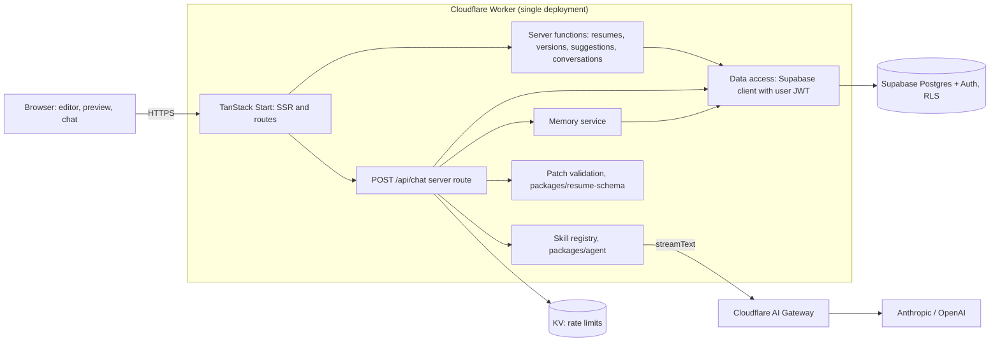

# Over-all Design: AI Resume Optimization Assistant

Spec version 1.0, 2026-09-01. Companion documents: `front-end.md`, `back-end.md`.

This document is the single source of truth for what the system is, how its parts fit together, and which decisions are settled. The two companion specs go into implementation detail for their halves. Together the three files are intended to be sufficient for an engineer (human or AI agent) to build the system without further product input.

---

## 1. Product

An AI-powered resume builder and optimization assistant.

A user keeps one or more **structured resumes**. Each resume is a JSON document with stable node IDs. The user edits it in a form-based editor while a live PDF preview renders it through an interchangeable **template**. The user can download the preview as a PDF at any time. The user can also open a chat panel, describe what they want changed (or tap a **playbook** chip for "rewrite bullets", "match to this job description", and the like), and ask the AI to improve the resume. The AI never edits an existing resume directly: it returns patches that are validated on the server and accepted one at a time. Creating a resume is the exception, and it is a narrow one: import and tailoring both write a whole document, because there is nothing yet to patch. Normal editing after creation goes through patches. The LinkedIn extension also permits an explicit Retry of the same creation workflow against its saved copy, with immutable input snapshots and guarded whole-document completion. See [the extension architecture and release guide](../extension/README.md).

The resume is the first-class citizen of the app. Everything else (conversations, suggestions, versions, memory) hangs off a resume.

### 1.1 Core user experience

1. Sign in. See a dashboard of resumes. Create, duplicate, rename, delete.
2. Open a resume. Left: section forms. Right: live PDF preview through the selected template.
3. Edit any field; the preview updates within roughly half a second; changes autosave.
4. Switch templates; content never changes.
5. Click Download; the file is the same PDF that is on screen.
6. Open the chat panel. Describe what to change, tap a playbook chip, or both. Optionally select a node (a bullet or an item) in the editor to scope the request. Type a message.
7. The assistant streams an explanation and a set of proposed patches, rendered as diff cards.
8. Accept or reject each patch (or all). Accepted patches are applied and a new version is created.
9. Open History to compare and restore versions.

### 1.2 One-sentence architecture

> A TanStack Start application on a single Cloudflare Worker, with Supabase Postgres as the only persistent state, Supabase Auth for identity, Row Level Security as the authorization boundary, `@react-pdf/renderer` in the browser for preview and export, and the Vercel AI SDK for model orchestration.

---

## 2. Principles

These survive any technology swap.

1. **Compute is replaceable; persistent state lives outside the runtime.** The Worker holds no state between requests.
2. **The LLM does not own canonical application state.** It receives context and returns patches.
3. **AI proposes; the application validates; the user decides.** No patch reaches the canonical resume without validation and explicit acceptance.
4. **Resume content and visual templates are independent.** Templates consume the document; switching templates cannot change content.
5. **Stable node IDs make AI editing deterministic and auditable.** Every section, item, bullet, and link carries an ID that survives edits and versions.
6. **Immutable versions make AI-assisted editing reversible.** Every accepted change is recoverable.
7. **Memory is retrieved selectively, never replayed blindly.** Each model request gets the context that is useful, not the whole history.
8. **Start with one deployment; split only when operations demand it.**
9. **Advanced agent frameworks solve real workflow complexity, not hypothetical complexity.** Plain AI SDK calls until loops, checkpoints, or multi-agent coordination are actually needed.
10. **Resume data is sensitive personal data.** It is never written to logs, traces, or analytics.

---

## 3. Scope and phases

### 3.1 Phase 1 (MVP)

Everything below ships in the MVP. The build order inside the MVP is chosen so the resume-only path is testable before the AI path exists.

| Step | Deliverable | Done when |
| --- | --- | --- |
| 1 | `packages/resume-schema`: Zod schema, node IDs, patch contract, `applyPatches`, `validatePatches` | Unit tests pass on fixtures |
| 2 | Supabase project, migrations for all seven tables, RLS policies, generated types | `supabase db reset` applies cleanly; RLS tests pass |
| 3 | Auth (login, callback, logout), dashboard, resume CRUD server functions | A user can create, list, open, rename, duplicate, delete resumes; another user cannot see them |
| 4 | `packages/resume-render`: one template (`modern`), fonts, `<ResumeDocument/>` | Renders a fixture resume to a PDF blob with the expected page count |
| 5 | Preview pane and Download | Editing the fixture in the browser updates the preview; the downloaded file equals the previewed blob |
| 6 | Editor forms for every section type, drag-to-reorder, autosave, template picker | Round-trip: edit, reload, same content; template switch keeps content |
| 7 | Versions: snapshot, list, restore, compare | History shows versions; restore creates a new version and updates the head |
| 8 | Agent vertical slice: chat panel, one skill (`bullet_rewrite`), `/api/chat` route, patches, diff cards, accept and reject, new version | End-to-end test: request, patch, accept, version created, preview updated |
| 9 | Remaining MVP skills (`jd_match`, `grammar_clarity`), `check_fit` client tool, `condense_to_pages` registered | Each skill has a prompt, an allowed-op set, and a passing eval fixture |
| 10 | Three-layer memory with in-request consolidation | After 12 messages a summary exists and is used on the next request |
| 11 | Templates `classic` and `compact` | Both render all fixtures without text overflow |

### 3.2 Phase 2

Add only when a real need appears.

- Cloudflare Queues or Workflows for memory consolidation and other background work
- Durable Object per resume if stream resumption on reconnect is needed
- Remaining skills: `ats_keyword`, `impact_quantification`, `summary_optimize`
- Job-description ingestion: done, stored standalone in `job_targets` and linked many-to-many to resumes via `resume_job_targets` (one posting can be tailored against twice, one resume can accumulate several applications).
- Resume scoring and ATS lint
- Render preview in a Web Worker if editor typing jank is measured
- Re-evaluate `@tanstack/ai` against the Vercel AI SDK

### 3.3 Phase 3

- Publish and share links (client renders PDF, uploads blob to R2, public route serves it)
- PDF and DOCX import with parsing into the schema
- A separate AI/API Worker behind a Service Binding, plus Hono, if mobile or third-party API consumers appear
- Vector retrieval for very long histories or knowledge bases
- Mastra or LangGraph if workflows need loops, checkpoints, or multi-agent coordination

### 3.4 Non-goals

- Real-time multi-user collaboration on one resume
- A free-form rich-text resume editor (the editor is structured forms)
- The model choosing which playbook to run (it does, through `find_skills` / `load_skill`; section 6.2)
- Server-side PDF rendering in the MVP

---

## 4. System architecture



### 4.1 Where things run

| Concern | Runs in | Why |
| --- | --- | --- |
| Resume editing state | Browser (TanStack Store) | Sub-100ms feedback |
| PDF layout, preview, download | Browser (`@react-pdf/renderer` + pdf.js) | Same artifact for preview and export; zero render infrastructure |
| `check_fit` (page count for a proposed change) | Browser, as an AI SDK client-side tool | The renderer is already loaded there; avoids running Yoga WASM on Workers |
| Auth session, CRUD, versions, suggestions | Worker server functions | Single trusted boundary; RLS applies through the user's JWT |
| Agent loop, patch validation, persistence | Worker server route | Streams SSE; stateless per request |
| Memory consolidation | Worker, after the response stream completes (`waitUntil`) | Does not delay the user; no queue needed yet |
| All persistent state | Supabase Postgres | Compute is replaceable |

### 4.2 Logical layers (inside the one Worker)

- **Web layer**: routes, SSR, streaming to the browser.
- **Application layer**: server functions and the chat route. Authorization, input validation, use-case coordination. Handlers coordinate services; they do not contain business rules.
- **AI orchestration**: builds context, runs the selected skill through `streamText`, exposes tools, persists the run.
- **Memory**: recent messages, active summary, full history on demand, consolidation.
- **Patch service**: validates patches against the base version and the document's rules, applies accepted patches, creates versions.
- **Data layer**: typed Supabase queries; one module per table.

---

## 5. Core flows

### 5.1 Edit, preview, export (no AI)

```text
form field change
  -> TanStack Store (Resume document)
  -> debounce 300ms -> <ResumeDocument resume template/> -> usePDF -> Blob
  -> pdf.js viewer shows the Blob (previous Blob stays visible until the new one is ready)
  -> debounce 800ms -> resumes.update server function -> resumes.data (head)
Download -> same Blob -> file
```

### 5.2 AI request

```mermaid
sequenceDiagram
    participant User
    participant Web as Browser (useChat)
    participant Route as POST /api/chat
    participant Mem as Memory
    participant Skill
    participant LLM
    participant DB as Postgres

    User->>Web: describe the change or tap a playbook chip, optional node, type message
    Web->>Route: conversationId, resumeId, hintSkillId?, selectedNodeId?, structural, messages
    Route->>Route: auth (getClaims), Zod validate, rate limit
    Route->>DB: load resume head; snapshot to a version if head differs from current version
    Route->>Mem: build context (active summary + last N messages)
    Route->>DB: insert agent_run (status running), insert user message
    Route->>Skill: system prompt + resume context + memory + tools
    Skill->>LLM: streamText
    LLM-->>Skill: text, tool calls (check_fit -> browser, propose_patches -> server)
    Skill->>Route: propose_patches: validatePatches, insert suggestions
    Route-->>Web: SSE stream (text, tool parts)
    Web-->>User: explanation + diff cards
    User->>Web: accept / reject per card
    Web->>Route: suggestions.decide(runId, decisions)
    Route->>DB: apply accepted patches to head, new resume_version, mark suggestions
    Route-->>Web: new head + version
    Route->>Mem: consolidate if threshold reached (after stream)
```

### 5.3 Version lifecycle

```text
resumes.data            the working head, updated by autosave
resumes.current_version_id -> the latest immutable snapshot

A version is created when:
  a) the user accepts one or more suggestions          created_by = 'agent'
  b) the user clicks "Save version"                     created_by = 'user'
  c) the user restores an older version                 created_by = 'user', label = 'Restored from vN'
  d) an agent run starts and head != current version    created_by = 'system', label = 'Before AI run'
Autosave never creates a version.
```

---

## 6. Domain model (conceptual)

Full Zod definitions live in `back-end.md` section 5 and are the contract for both halves.

### 6.1 Resume document

```text
Resume
  schemaVersion: 1
  basics            id 'basics': name, headline, email, phone, location, links[], summary
  sections[]        ordered; each: id, type, title, items[]
    experience item id, company, role, location, start, end|'present', bullets[]
    education item  id, school, degree, field, start, end, bullets[]
    project item    id, name, url, start, end, bullets[]
    skills group    id, label, skills[]  (strings)
    custom item     id, title, subtitle, start, end, bullets[]
  bullet            id, text
  link              id, label, url
```

Presentation settings (`template_id`, page size, font scale) live on the `resumes` row, not in the document, so versions capture content only and template switches never touch content.

### 6.2 Playbooks

A playbook is prompt text about how to do one thing well: an ID, a name, a when-to-use line, a not-for line, a starter sentence for the composer, and a body. It grants nothing. There is no per-playbook allowed-op set, no scope rule and no tool list, because the tool set is the same for every turn and what a patch may do comes from the document and the request instead (section 6.3).

The model chooses which playbooks fit the message, through `find_skills` (search) and `load_skill` (read one), saying what it is about to do in its plan line first. A chip in the composer is a shortcut, not a mode: it writes a starter sentence into the box and travels as an advisory hint. A hint the message contradicts is ignored, and the turn is never refused for naming a playbook the release does not ship. This replaces the old explicit picker: the earlier "the user picks the skill, there is no router" decision is superseded, and the reason it was once avoided (an extra model call to classify intent) no longer applies, because selection happens inside the turn that was going to run anyway.

| Playbook | Capability |
| --- | --- |
| `bullet_rewrite` | Rewrite bullets, lead with outcomes, preserve facts |
| `jd_match` | Match a job description, report gaps, reorder or drop what does not match |
| `grammar_clarity` | Grammar, tense, resume register, no AI-sounding phrasing |
| `condense_to_pages` | Fit to N pages using `check_fit` |

Those four ship. The further playbooks once planned here (`ats_keyword`, `impact_quantification`, `summary_optimize`) are not in the library; adding one is a row in `packages/agent/src/skills/catalog.ts` plus a body, and nothing else has to change.

### 6.3 Patch contract

The AI communicates edits through `ResumePatch`, a discriminated union of five operations, each addressed by node ID and each carrying `before` so the server can verify grounding. Defined in `back-end.md` section 6. Validation rejects a patch when the target does not exist, `before` does not match the current value, the result fails the schema, the field is one no patch may write, or the patch is **structural** (deleting an item or a section, adding one, moving a node into another container) and the turn did not ask for that. The tier is computed from the patch and the document, never stated by the model or the client, and a structural suggestion is accepted one at a time rather than in bulk.

### 6.4 Memory

Three layers per conversation:

1. **Short-term**: the last 12 messages.
2. **Consolidated**: a structured summary (`user_goal`, `resume_focus`, `preferences`, `decisions`, `open_tasks`) plus a text rendering, regenerated when 12 messages have accumulated since the last summary, executed after the response stream completes.
3. **Full history**: every message, summary, suggestion, and version in Postgres; loaded only on demand (History view, future retrieval).

Clearing the conversation (front-end section 7.1) drops the short-term and consolidated layers and the message rows. Runs, suggestions and versions stay as the record, and the conversation row itself stays.

---

## 7. Repository layout

The repo is a Bun + Turborepo monorepo. The architecture document's Appendix B single-tree layout is mapped onto it as follows.

| Appendix B path | This repo | Notes |
| --- | --- | --- |
| `src/routes/` | `apps/web/src/routes/` | TanStack file routes, including `api/chat.ts` |
| `src/features/resume/{editor,preview,versions}` | `apps/web/src/features/resume/{editor,preview,versions,dashboard}` | |
| `src/features/chat` | `apps/web/src/features/chat` | `useChat`, diff cards, playbook chips, the structural toggle |
| `src/server/auth` | `apps/web/src/server/auth` | Supabase SSR client, `requireUser` |
| `src/server/db` | `supabase/types/database.ts` | generated types, owned by the package that owns the migrations |
| `src/server/resume-service` | `packages/resume-core/src/services/` | resume, version, run, suggestion services on ports; Supabase adapters in `apps/web/src/server/adapters/` |
| `src/server/memory` | `packages/resume-core/src/services/memory-service.ts` | context builder, consolidation; the summarizer is a port implemented in `packages/agent` |
| `src/server/ai/orchestrator.ts` | `apps/web/src/server/chat/handle-chat.ts` | wires request to `packages/agent` |
| `src/server/ai/patch-schema.ts` | `packages/resume-schema/src/patch.ts` | shared with the browser for `check_fit` and diffs |
| `src/server/ai/skills/*` | `packages/agent/src/skills/*` | headless, testable with a mock model |
| `src/templates/*` | `packages/resume-render/src/templates/*` | react-pdf components |

Package dependency direction (arrows point at dependencies):

```text
apps/web -> packages/ui
apps/web -> packages/resume-schema
apps/web -> packages/resume-render -> packages/resume-schema
apps/web -> packages/agent         -> packages/resume-core -> packages/resume-schema
packages/resume-schema -> (nothing internal)
```

`resume-schema` has no React, no Supabase, no AI SDK. `resume-core` holds the domain types, the ports, the services, and in-memory doubles for every port; it has no framework dependency at all. `agent` has no Supabase and no React; it receives models, tools, and persistence callbacks by injection. `resume-render` has no app state and no network. `apps/web` owns everything that touches Supabase or Cloudflare.

---

## 8. Decision log

| # | Area | Decision | Rationale |
| --- | --- | --- | --- |
| 1 | Framework | TanStack Start, not Next.js | Logged-in SaaS, no SEO need, closest fit to the Cloudflare runtime |
| 2 | Compute | One Cloudflare Worker | Short AI requests, one domain, one secret store, no cross-Worker auth |
| 3 | Persistence | Supabase Postgres via PostgREST from the Worker | HTTP client works on Workers; RLS gives per-user isolation without application-level ownership checks in every query |
| 4 | Auth | Supabase Auth with `@supabase/ssr` cookie sessions | Same vendor as the database; RLS uses `auth.uid()` |
| 5 | Authorization | RLS on every table; the Worker uses the anon key plus the user's JWT; no service-role key in the request path | Ownership is enforced by the database, not remembered by each handler |
| 6 | Agent runtime | Stateless server route with `streamText` and SSE; no Durable Object in MVP | Context is rebuilt from Postgres per request; DO only if stream resumption is needed |
| 7 | AI SDK | Vercel AI SDK 7 (`ai`, `@ai-sdk/react`) | Streaming, provider abstraction, client-side tools, Zod tool schemas, `MockLanguageModelV3` for deterministic tests |
| 8 | Model access | DeepSeek direct (`@ai-sdk/deepseek`), `deepseek-v4-flash` on both tiers, behind a provider switch in `packages/agent/src/models.ts` | One key, one vendor to start; changing model or vendor is config plus one `case`, and a gateway can be put in front through `AI_BASE_URL` |
| 9 | Playbook selection | Chosen by the model inside the turn, from a prompt-text library | One round trip instead of a classifier call, and the plan line makes the choice visible; a hint from the composer nudges it without binding it |
| 10 | PDF engine | `@react-pdf/renderer` in the browser, preview is the PDF itself | Deterministic layout across browsers, no pagination code, no render infrastructure; resolves the "fidelity" open question |
| 11 | Versioning | Working head in `resumes.data` plus explicit immutable versions | Autosave stays cheap; every AI change and every user checkpoint is recoverable |
| 12 | Memory | Three layers in MVP, consolidation after the stream through a `Background` port (`waitUntil` on Workers) | Full design present from day one; Queues deferred until volume demands |
| 13 | Code layout | Monorepo packages `resume-schema`, `resume-core`, `resume-render`, `agent`, `ui`, app in `apps/web` | Hexagonal: domain services on ports in `resume-core`, AI SDK code in `agent`, Supabase and Cloudflare adapters in the app; every layer is testable without the one above it |
| 14 | Styling | Tailwind v4 + shadcn on Base UI for app chrome only; templates use react-pdf `StyleSheet` | react-pdf cannot see CSS; the separation is enforced by the library |
| 15 | Lint and format | Biome | Already configured in the repo |
| 16 | Skills to ship first | `bullet_rewrite`, `jd_match`, `grammar_clarity`, `condense_to_pages` | Cover the most common requests; exercise single-node, multi-op, and whole-document scoping, and the one client-side tool (`check_fit`) |
| 17 | Rate limiting | Count of the user's `agent_runs` in the last hour, through RLS | One source of truth; no KV counter to drift from the rows it mirrors |

---

## 9. Cross-cutting requirements

- **Security**: secrets only in Worker secrets; no model API key in the browser; RLS on every table; all inputs Zod-validated at the boundary; patches validated before persistence and again at accept time.
- **Privacy**: never log resume content, message content, or patch text. Log IDs, counts, durations, token usage, status, error class.
- **Cost**: send the whole document (the ids are needed regardless, and the assistant picks its own playbook); send the active summary plus the last 12 messages, never the full history; route summaries to the cheap model tier; per-user hourly rate limit on `/api/chat`.
- **Observability**: every `agent_runs` row records model, skill, latency, tokens, status, error class. Accept and reject rates per skill are derivable from `suggestions`.
- **Accessibility**: app chrome follows shadcn defaults; the PDF viewer exposes the pdf.js text layer.

---

## 10. Glossary

- **Resume document**: the JSON content of a resume, validated by the `Resume` Zod schema.
- **Head**: the current working copy in `resumes.data`.
- **Version**: an immutable snapshot row in `resume_versions`.
- **Node**: any object in the document with an `id` (basics, section, item, bullet, link).
- **Skill**: a registered AI capability with a prompt fragment and allowed operations.
- **Patch**: one proposed change, addressed by node ID, with `before` and `after`.
- **Suggestion**: a persisted patch with a status (`pending`, `accepted`, `rejected`, `stale`).
- **Agent run**: one execution of a skill for one user message, with its audit record.
- **Template**: a react-pdf component that renders a resume document.
