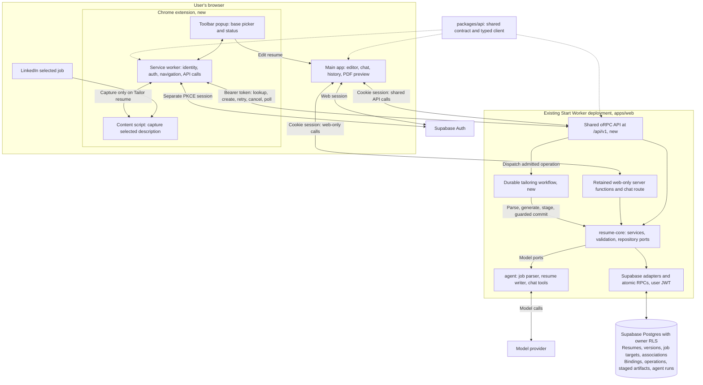

# LinkedIn Chrome Extension: Implementation Plan

Date: 2026-09-24

Status: Implementation plan for the workflow agreed in the design interview. No application or extension code has been changed by this plan.

## Outcome and scope

Build a Chrome toolbar popup that detects a supported LinkedIn job page, looks up the job's associated resume, and lets an existing user create a tailored resume from a selected base. Generation continues on the server after the popup or browser closes. Returning to the job shows the saved generation result.

Product decisions:

- Automatically open the popup for supported pages in the active tab of the focused window. Detect matching background tabs without interrupting another tab; evaluate them on activation.
- Accept only HTTPS URLs on `www.linkedin.com` with `/jobs/search-results/` and a nonempty query string, or a valid `/jobs/view/<job>` path. The question mark begins the query, not the pathname.
- Identify the selected job as `(platform, externalJobId)`, using `platform = "linkedin"` and `currentJobId` on search results or the numeric ID from a view URL. Different tracking parameters and URL forms must resolve to the same job; the source URL is metadata, never the identity.
- A matching search URL without a resolvable job ID shows "Select a job on LinkedIn". It is not a database miss.
- One associated live resume per user and LinkedIn job, independent of the chosen base resume.
- Opening the popup does not generate a resume. The user selects a base and clicks **Tailor resume**, with no description-review step.
- Success: **"Resume is ready, now apply"** and **Edit resume**. The message is not a button and does not apply, download, or open an application form.
- Failure: **Retry** and **Edit resume**. Retry tailors the same resume against the saved job description.
- In progress: **"Creating a tailored resume…"**, loader, and **Cancel**.
- Cancellation retains the clone and offers **Retry** and **Edit resume**.
- Edit opens `/r/<resumeId>/edit` on the configured main-app origin.
- Later manual edits do not invalidate readiness. Track the creation workflow's successful result, including recovery attempts, rather than resume quality or PDF readiness.
- Query the backend for current state. A missing or soft-deleted associated resume becomes the ordinary no-resume state.
- Capture failure: **"Could not read the job description. Try again."** with a retry action. No paste fallback.
- Existing users connect their account and need at least one base resume. First-resume creation stays in the main app.
- No completion notifications, toolbar badges, automatic resume tabs, PDF rendering, application automation, side panel, or injected page buttons.

Implementation defaults to retain unless testing identifies a concrete problem: remember the last base selection per account; poll only while the popup is open; avoid repeatedly reopening a dismissed popup for duplicate navigation events belonging to the same tab and job.

## Current code and required changes

| Existing seam | Current behavior | Required change |
| --- | --- | --- |
| `packages/resume-core/src/domain/linkedin.ts` | Normalizes `currentJobId` and view paths, accepts more hosts and paths than this MVP | Reuse normalization behind a stricter extension eligibility predicate |
| `packages/resume-core/src/services/tailor-service.ts` | Parses first, creates a target and clone, writes a whole tailored document | Extract reusable generation logic; create the extension clone before any AI call; support retry on that clone |
| `apps/web/src/server/fns/jobs.ts` | Awaits both model calls before returning | Keep the existing contract compatible; add shared asynchronous tailoring procedures |
| `apps/web/src/lib/api.ts` and `server/fns/resumes.ts` | Web-only wrappers around server functions | Move the shared resume-list call onto the common API contract and implementation; retain web-only server functions |
| `apps/web/src/features/import/use-tailor.ts` | Request-bound work, no queue | Do not make the popup depend on this hook or a live web tab |
| `job_targets` and `resume_job_targets` | Internal UUIDs and source URLs, but no external job identity; many-to-many associations | Add nullable `platform` / `external_job_id` to targets and a binding unique per user/platform/job, preserving existing app associations |
| `agent_runs` | Starts after parsing and clone creation | Add an operation record spanning admission, parsing, generation, and final commit; retain runs for model accounting |
| `apps/web/src/server/auth/supabase.ts` | User-scoped cookie auth and RLS | Add verified bearer auth for extension requests and bounded user credentials for background work |
| `apps/web/src/server/adapters/resume-repository.ts` | Soft deletion via `deleted_at`; optimistic concurrency via `revision` | Apply both guards to lookup, retry, and generation commits |
| `apps/web/wrangler.jsonc` | Single TanStack Start Worker; no Workflows binding | Add a durable workflow and an entrypoint exporting it alongside the app |

The ordinary chat approval contract stays intact. Explicit extension creation and Retry are the narrowly authorized whole-document tailoring operations. Document this exception instead of turning general assistant edits into direct writes.

## Technical design

Use Manifest V3, Chrome 127+, React 19, TypeScript, Vite, and existing `packages/ui` primitives. Add `apps/extension` as a Bun workspace. A native Vite setup is sufficient; no extension framework is required for this scope.

Deployment decision: keep the shared API in the existing TanStack Start Worker deployed from `apps/web`. Do not introduce `apps/api`, another API Worker, or a Service Binding for this release. Use oRPC contract-first definitions and a shared typed client in `packages/api`; mount its Fetch-compatible OpenAPI handler in a Start Server Route under `/api/v1`. This retains explicit JSON HTTP routes while allowing both clients to call typed procedures. The extension remains an independently built and released app.

Use Cloudflare Workflows for server-owned execution. Supabase remains the authoritative store for resume content, bindings, and operation status. Workflow step outputs should contain IDs and safe metadata only; keep document and job content in the existing protected database. The browser service worker handles navigation, authentication, capture coordination, and short API calls, never the model request itself.

### Repository structure and app boundaries

The extension is an independent application at `apps/extension`, alongside `apps/web`. It owns its package manifest, entrypoints, configuration, tests, build output, and release artifact. It can be developed and packaged without starting or building the web app. Runtime backend access uses the configured deployed API origin; generation does not require an open main-app tab.

Proposed structure (extension files, the API package, and the shared API/workflow backend modules are new):

```text
apps/
  extension/                         # Independent Chrome application
    package.json                    # @workspace/extension
    manifest.json                   # Manifest V3 and permissions
    popup.html                      # Popup HTML entrypoint
    vite.config.ts                  # Popup, background, content entries
    tsconfig.json
    vitest.config.ts
    .env.example                    # Public app/Supabase configuration
    public/icons/
    src/
      popup/
        main.tsx
        App.tsx
        queries.ts                  # Popup query keys and invalidation
        styles.css                  # Shared UI tokens and popup styles
      background/
        index.ts                    # Extension service-worker entrypoint
        navigation.ts               # Tab detection and popup opening
        messages.ts                 # Validated message handlers
      content/
        linkedin.ts                 # Selected-job description capture
      lib/
        api.ts                      # Configures shared client, background only
        auth.ts                     # Session management, background only
        config.ts                   # Validated public configuration
        messages.ts                 # Internal message schemas and client
    test/                           # Chrome mocks and sanitized DOM fixtures
    dist/                           # Generated unpacked extension, gitignored
  web/                              # Existing web app and shared backend
    src/
      routes/                       # Existing routes plus /api/v1 handler
      lib/api.ts                    # Web facade, shared client for common calls
      server/
        api/
          context.ts                # Cookie/Bearer auth, services, logger
          router.ts                 # Implements the shared contract
          handler.ts                # OpenAPI handler, CORS, CSRF, errors
          procedures/               # Resumes, jobs, operations
        tailoring/                  # Durable workflow and dispatch
        adapters/                   # Supabase repository implementations
packages/
  api/                              # @workspace/api, browser-safe
    src/
      contract/                     # oRPC routes, input/output/error schemas
        resumes.ts
        jobs.ts
        operations.ts
        index.ts
      client.ts                     # Typed OpenAPILink client factory
  resume-core/
    src/
      contracts.ts                  # Curated pure domain schemas and helpers
      domain/                       # Job identity and operation schemas
      services/                     # Shared tailoring business logic
      ports/                        # Repository and model interfaces
  agent/                            # Server-only model integration
  resume-schema/                    # Resume document and patch schemas
  resume-render/                    # Main-app PDF rendering
  ui/                               # Shared React primitives and design tokens
supabase/
  migrations/                       # Shared database migrations
  tests/                            # SQL transaction and RLS tests
  types/                            # Generated database types
```

Dependency boundaries:

- Both apps import API contracts and the typed client factory through `@workspace/api/contract` and `@workspace/api/client`. The shared package accepts base URL, fetch, and header providers; it owns no session storage, framework request context, or Chrome APIs.
- `packages/api` reuses domain schemas through the new browser-safe `@workspace/resume-core/contracts` subpath and resume schemas from `@workspace/resume-schema`. The core subpath exports only pure schemas and identity helpers, with no service composition, model code, database adapters, or server runtime imports. Keep oRPC transport definitions out of `resume-core` and avoid redefining domain types in the API package.
- `apps/extension` imports shared UI from `@workspace/ui`. The two apps do not import each other's source files. Each owns its query integration and authentication configuration; the extension additionally owns session storage and Chrome messaging.
- The popup calls the extension service worker through typed messages. Only the service worker imports `lib/api.ts` and `lib/auth.ts`; the content script receives capture requests without account credentials.
- The existing Cloudflare backend remains deployed from `apps/web`. Its `server/api` implements the common contract once using `resume-core` services; it serves both clients and owns Workflows, model credentials, database access, and authorization. Keep request/response handling thin so business logic remains independent of Start.
- The extension uses a configured app origin for API requests and editor links. Its bundle contains public configuration only; model keys and workflow encryption secrets remain on the backend.

Workspace integration: the root's existing `apps/*` Bun workspace glob already includes the new app. Name it `@workspace/extension`, give it its own `dev`, `build`, `typecheck`, `lint`, `format`, and `test` scripts, and account for `apps/extension/dist/**` in Turbo build outputs (the current root default only tracks `.output/**`). Keep extension development as a standalone build/watch workflow for an unpacked extension. Scoped checks use `bun run --filter @workspace/extension typecheck` and `bun run --filter @workspace/extension test`. The user runs packaging/build and loads `apps/extension/dist`; implementing agents must not run the build.

### System architecture

This is the proposed architecture after extension implementation. The main app, core services, agent package, and Supabase already exist; the extension, shared oRPC API, durable workflow, bindings, and operation storage are additions. The API and web app share one Start Worker deployment; the extension has its own build and release artifact.



The API atomically admits work before dispatching the workflow. The workflow continues after the popup closes; the popup reads persisted status when reopened. Only validated output that passes cancellation, deadline, deletion, and revision guards can replace the saved resume. Ordinary chat edits still require accepted patches. The proposed bounded workflow credential handoff remains subject to Task 1 validation.

### Authentication and background credentials

Use a separate Supabase Google OAuth PKCE session for the extension, started only by **Connect account** through `chrome.identity.launchWebAuthFlow`. This connects the existing account without copying the main app's cookies or sharing its rotating refresh token. Add the exact development and production extension callback URLs to Supabase's redirect allowlist. Show the connected account so an accidental different Google identity is apparent.

Keep session management in the extension service worker with a Supabase custom storage adapter. Restrict storage to trusted extension contexts; never use sync storage or send credentials to LinkedIn content scripts. Refresh on demand and serialize refresh attempts. API requests send the user access token; the backend verifies it and constructs the same RLS-scoped adapter set used by the web app. Resumes and operations are accessed only through app endpoints.

The shared API accepts the web app's same-origin cookie session or the extension's bearer token. Resolve either into one per-request context containing verified user, RLS-scoped services, and logger. An invalid supplied bearer token must fail authentication rather than silently falling back to cookies. Cookie-authenticated mutations require explicit CSRF/origin protection at the Server Route boundary; do not assume server-function middleware protects it. Preserve refreshed cookies and no-store headers on web responses. Browser clients share procedure names and data contracts, not session credentials.

Background processing must not silently introduce a service-role key. Proposed MVP credential handoff:

1. Before submission, ensure the access token remains valid beyond the configured operation deadline plus a safety margin; refresh and retry admission once if needed.
2. Use a five-minute total attempt deadline initially, with at least one further minute of token validity. Confirm these bounds in the runtime task below.
3. Pass the workflow an authenticated encrypted envelope containing the short-lived access token, operation ID, user ID, deadline, and envelope version. Use a dedicated Worker secret, fresh nonce, and authenticated binding to the operation. Never pass a refresh token.
4. Reconstruct a per-operation Supabase client under that user's JWT. Verify identity and operation ownership before work; enforce the deadline before every external step and commit.
5. If execution outlives the deadline or the credential becomes unusable, do not write generated content. A subsequent authenticated status request reconciles a nonterminal expired operation to failure using fresh caller credentials, enabling Retry.

This is an implementation proposal, not an already existing capability. Task 1 must validate durable credential handling, expiry, and runtime exports before building on it. If this cannot meet RLS and privacy requirements, revise that infrastructure design explicitly instead of bypassing RLS or reverting to request-lifetime work.

### Database model and lifecycle

#### Job identity and target schema

Keep the existing internal `job_targets.id` UUID for foreign keys. Add the platform's identifier separately, since one external job can have multiple URLs and multiple saved posting captures.

| Domain field | SQL column | Meaning |
| --- | --- | --- |
| `id` | `id` | Existing internal UUID for this saved job target |
| `platform` | `platform` | Nullable supported platform key; initially `"linkedin"` |
| `externalJobId` | `external_job_id` | Nullable platform-issued ID, stored as text |
| `sourceUrl` | `source_url` | Existing nullable source link; not a lookup or uniqueness key |
| Existing posting fields | Existing columns | `rawText`, title, company, location, requirements, and creation time remain |

For example, both of these URLs resolve to `{ platform: "linkedin", externalJobId: "4456278957" }`:

```text
https://www.linkedin.com/jobs/view/4456278957/
https://www.linkedin.com/jobs/search-results/?currentJobId=4456278957&keywords=engineer
```

Identity rules:

- Introduce Zod schemas for platform, external identity, `JobTarget`, and `NewJobTarget` in `resume-core`; derive their TypeScript types from those schemas. The current `JobTarget` is a handwritten type. Keep posting identity outside the resume document schema.
- `platform` and `externalJobId` must either both be present or both be null, enforced in Zod and SQL. A pasted description or unrecognized source link has null identity. Do not invent an ID from its URL, title, or text hash.
- Validate IDs by platform. LinkedIn uses the existing digits-only, minimum-six-digit rule and keeps the ID as a string. Future platforms can add their own ID rules without changing the internal UUID or assuming numeric IDs everywhere.
- Resolve identity deterministically from the source URL on the server, never from model output. Preserve the main app's broader URL support while applying the stricter eligibility predicate to extension requests. A view path determines its job ID; a conflicting `currentJobId` must be rejected by the extension instead of silently selecting another job.
- Derive a canonical LinkedIn link from the identity when needed. Existing canonical `sourceUrl` values remain valid; original supported source URLs are also metadata and need not match byte for byte.
- Add a nonunique partial index on `job_targets(user_id, platform, external_job_id)` for identified targets. Multiple captures or existing app tailoring operations may refer to the same external job; do not deduplicate posting text or merge existing target rows.
- Enforce one extension-selected resume in `job_resume_bindings` with unique `(user_id, platform, external_job_id)`. Binding identity is required. Validate that its target has the same owner and identity in every binding-write transaction. The existing many-to-many `resume_job_targets` association remains unchanged.

Migration and compatibility: add nullable columns first, populate both fields for recognizable existing LinkedIn URLs through the shared identity rules, and leave unresolvable rows null. Make backfill idempotent and process it through an owner-scoped migration task without introducing service-role credentials. Preserve all target IDs, resume associations, source URLs, and captured text. Update both the main-app creation path and extension admission to populate identity before enabling legacy adoption. Until the backfill completes, legacy lookup must resolve recognizable URLs on null-identity rows as a compatibility fallback. Do not add URL uniqueness or target-identity uniqueness.

#### Bindings and operations

Add two concepts, with Zod schemas, ports, Supabase adapters, and in-memory implementations:

- `job_resume_bindings`: `id`, `user_id`, `platform`, `external_job_id`, associated `resume_id`, `job_target_id`, selected `source_resume_id` (nullable if later deleted), current operation ID, timestamps. Unique `(user_id, platform, external_job_id)`. Derive canonical URLs from identity instead of duplicating them on the binding. Only LinkedIn is supported in this release.
- `tailor_operations`: operation UUID, binding/resume/target IDs, user ID, attempt number, status, expected resume revision, input version ID, idempotency key, workflow ID, deadline, timestamps, safe error class, and agent-run reference. Unique idempotency key per user and at most one active attempt per binding. Statuses: `queued`, `running`, `succeeded`, `failed`, `cancelled`.

Store generated intermediate output in a private child table, `tailor_operation_artifacts`, keyed by operation ID and protected by the same owner RLS. It holds validated document content, its hash, and creation/expiry timestamps. Writes are idempotent per operation. Remove it in terminal-state transactions and opportunistically during authenticated expired-operation reconciliation. Input snapshots remain ordinary immutable resume versions; workflow step results contain neither input nor output document content.

An operation snapshots its input so a replay reads the same resume content. The initial snapshot is the fresh clone. A user-triggered Retry snapshots the associated resume's current saved content, preserving any edits made since failure. Store captured text in `job_targets`; reuse parsed requirements if a previous parsing step completed. Before parsing, initialize requirements with valid empty arrays, not the existing SQL default `{}`, which does not satisfy `JobRequirementsSchema`.

Use owner RLS, explicit grants, and `security invoker` RPCs for transactions. Check ownership of every linked row. Clone content, fresh node IDs, template settings, and content hashes are prepared using existing schema/core helpers; SQL owns atomic persistence, not schema transformations.

Required atomic boundaries:

- Admission locks the binding key, checks/reserves quota, and creates the binding, target, clone, initial snapshot, run/accounting record, and operation together. Concurrent submissions return the same existing result and leave no orphan clones. Replays do not consume quota twice.
- Retry locks the binding, allows a new attempt only after failure/cancellation, snapshots current content, and replaces the current-operation pointer. It never creates another resume. Repeated retry requests with the same key return the same attempt.
- Success locks the binding/operation/resume in a consistent order, verifies the current attempt is still runnable, the deadline has not passed, the resume is not deleted, and `revision` still matches. Persist the validated head, subtitle/title updates as appropriate, immutable version, run completion, and operation success in one transaction. Reuse `create_resume_version` behind these guards.
- Cancel changes the database state first, then requests workflow termination. Once cancellation wins the transaction, a late model response cannot commit. If success won first, return success. Failure to terminate external compute must not undo the cancellation fence.
- Failure updates status without replacing resume content. Duplicate workflow execution or late callbacks cannot replace a terminal state or the result of a newer attempt.

Handle soft deletion explicitly. A foreign-key cascade does not fire when `deleted_at` changes. Lookup must join only live resumes; cancel/fence work attached to deleted rows, and allow the next explicit create request to replace the stale binding under a lock. Do not automatically revive a deleted copy.

For pre-extension resumes, add a deterministic adoption path: if no explicit binding exists, look for this user's live origin associations with the same `(platform, externalJobId)`, pick the most recently created origin association (stable ID tie-break), and pin that selection. Use the null-identity URL fallback described above only during migration. Infer success only from a completed tailoring run with its persisted version. Failed or cancelled runs retain those states; a legacy request still running is reported as running until reconciled. Unverifiable legacy state must not be guessed ready. Once a binding exists, later duplicates or edits do not change which resume the extension displays. If a binding's resume is deleted, do not fall back to an older legacy resume.

### Proposed API contract

Define the shared API in `packages/api` using oRPC contract-first schemas. Mount one OpenAPI handler under `/api/v1` in a TanStack Start Server Route, implemented by `apps/web/src/server/api`. Both clients use the same typed client factory with OpenAPILink; do not expose a second RPC transport or make the extension call TanStack's generated server-function transport. Define JSON-safe input/output schemas, explicit methods/paths, success statuses, and safe errors once in the contract. Derive TypeScript types from schemas.

| Shared procedure | HTTP route relative to `/api/v1` | Contract |
| --- | --- | --- |
| `resumes.list` | `GET /resumes` | Return live resume summaries for the web list and extension picker; retain the existing web result shape |
| `jobs.lookup` | `GET /jobs/:platform/:externalJobId` | Return `none` or the live binding, resume ID, current operation status, and permitted actions; reconcile stale state |
| `jobs.tailor` | `POST /jobs/:platform/:externalJobId/tailor` | Accept source resume ID, captured job text, supported source URL, and idempotency key; create or return the one binding; return `202` for admitted work |
| `jobs.retry` | `POST /jobs/:platform/:externalJobId/retry` | Accept expected failed/cancelled operation ID and a new idempotency key; use the existing resume and stored description |
| `operations.cancel` | `POST /operations/:operationId/cancel` | Idempotently cancel the current attempt and return authoritative status |

Validate that URL-derived platform and external job ID equal the route identity. Reject unsupported platforms; a generic route does not enable capture from additional sites. The caller never supplies an authoritative user ID, arbitrary destination URL, or workflow class. Map existing domain errors into the shared contract once, preserving the app's error codes, HTTP statuses, and rate-limit metadata. Web callers continue to receive the existing `ApiError` behavior through their facade. Return `Cache-Control: no-store`; allow same-origin web requests and explicitly allow only configured extension origins in CORS/preflight handling. CORS is not authorization, so every request still requires verified user authentication and RLS.

Migration scope:

- Move the web's existing `listResumes` facade to `resumes.list`, preserving `lib/queries.ts` keys, invalidation, loader behavior, and response shape. Both apps must exercise the same procedure implementation, not just similarly named endpoints. Remove the old server-function wrapper once no caller remains.
- For web SSR, use a server-only direct client for the same implemented router with a fresh authenticated context per request. Propagate session-refresh cookies and invoke the same validation, authorization, and error mapping. Never place user credentials in a shared singleton. The browser uses the HTTP client; extension calls it only from the service worker.
- Keep unrelated web-only server functions and the existing streaming chat route. Preserve the synchronous `tailorFromJob` public contract and UI behavior for this release; its generation helpers are shared with the new asynchronous procedures. Moving the main web tailoring UI to operation-based generation is separate work.
- Keep API v1 compatible with already distributed extensions. Add optional fields and new procedures compatibly, test older request shapes, and deploy API support before publishing a client that needs it. Sharing TypeScript types does not make installed clients upgrade automatically.

Separate transport failure from stored operation failure. Offline, expired auth, an unreadable response, or a database error must never become `none` or `failed generation` in the UI. Ambiguous submission outcomes recover by lookup/replay with the same idempotency key.

### Load and concurrency boundaries

Keep API requests short: authenticate, validate, read or admit work, and return. Model generation runs in Workflows with bounded retries and deadlines. Admission reserves per-user quota atomically before any model work; the existing read-then-check hourly limit is not sufficient for concurrent submissions. Respect model-provider throttling with bounded backoff, and fail recoverably when the attempt deadline or credential validity prevents another retry. Per-user quotas do not guarantee provider-wide capacity; use measured load to decide whether a separate scheduling mechanism is needed.

Status reads return compact metadata, never the saved resume or captured text. Add jitter and error/rate-limit backoff to popup polling, stop when closed, and avoid overlapping polls. Monitor request latency, database round trips, active operations, model throttling, and Worker resource errors using safe metadata only. Co-locating the API with Start does not remove downstream capacity limits; this release does not claim a throughput target without measurement.

## Implementation tasks

### Task 1: Validate the runtime and credential boundary

Depends on: nothing.

Files: `apps/web/wrangler.jsonc`, a proposed custom Worker entrypoint, `apps/web/src/server/auth/`, proposed `apps/web/src/server/tailoring/`.

- [ ] Confirm Cloudflare Workflows availability for the deployment and test the binding/export shape with the installed Cloudflare Vite plugin and TanStack Start. Keep the existing Worker deployment with a named workflow export.
- [ ] Resolve current official TanStack custom-entry documentation through Context7 before changing the entrypoint. Keep its request handler intact.
- [ ] Verify an independent extension PKCE session can authenticate the same existing account, refresh after extension-worker restart, and coexist with the web session.
- [ ] Implement/test the bounded encrypted access-token handoff, deadline checks, tamper rejection, key-version handling, and user-scoped RLS client construction.
- [ ] Confirm provider/model execution fits the five-minute bound. Set explicit model and workflow timeouts and bounded infrastructure retries. Do not extend an attempt beyond token expiry.
- [ ] Ensure workflow metadata, parameters, thrown errors, and step outputs cannot expose raw credentials, resume text, or job descriptions in logs/traces.
- [ ] Record exact callback origins, extension IDs, workflow binding name, and secret/configuration names in the deployment section of this plan when known. Do not invent production domains.

Done when: a non-UI integration test proves work can run after the submitting request ends, remain user-scoped, and fail safely on expiry; static checks verify the entrypoint. Deployment and manual runtime verification remain explicit release steps.

### Task 2: Define shared contracts and pure identity rules

Depends on: Task 1's selected infrastructure boundary.

Files: `packages/resume-core/src/domain/job-target.ts`, `src/domain/linkedin.ts`, new `src/domain/job-identity.ts`, `src/domain/linkedin-extension.ts`, `src/domain/tailor-operation.ts`, `src/contracts.ts`, the package's `exports`, and new `packages/api/package.json`, `src/contract/`, `src/client.ts`, configuration and contract tests.

- [ ] Add the strict extension URL eligibility rule without narrowing the main app's existing normalizer.
- [ ] Add shared platform/identity schemas and migrate `JobTarget` / `NewJobTarget` to Zod-derived types with paired nullable `platform` and `externalJobId`. Extract identity and canonical URL from one shared parser; retain the existing `normalizeLinkedInJobUrl` public contract.
- [ ] Define domain operation states and identity schemas in core, and oRPC input/output/error contracts and explicit HTTP routes in `packages/api`. Keep popup-state mapping in the extension. Derive TypeScript types from schemas.
- [ ] Define stable `(userId, platform, externalJobId)` binding identity, idempotency semantics, and a distinction between unsupported page, no selected job, database miss, and unavailable lookup.
- [ ] Export only pure domain schemas and identity helpers through `@workspace/resume-core/contracts`. Add `@workspace/api/contract` and `@workspace/api/client` exports with no transitive server runtime dependencies.
- [ ] Implement the shared OpenAPILink client factory with injectable base URL, fetch, and headers; define no credentials or global authenticated client in the shared package. Resolve the selected oRPC version and adapter APIs through Context7 before implementation.
- [ ] Add contract tests for request/response validation, safe error mapping, and compatibility with existing resume-list results. Give the API package Bun typecheck/lint/format/test scripts.
- [ ] Add table-driven tests for both supported routes, query order and tracking variants, missing/non-numeric IDs, slugged view paths, spoofed hosts, HTTP, unsupported LinkedIn paths, conflicting path/query IDs, and URL/route identity mismatch. Cover null identity, incomplete identity pairs, and unsupported platform values.

Done when: view/search forms of one job produce one key and unrelated pages cannot initiate capture or generation.

### Task 3: Add persistence, atomic operations, and RLS tests

Depends on: Task 2.

Files: new `supabase/migrations/*_linkedin_extension.sql`, `supabase/tests/070_linkedin_extension.test.sql`, `supabase/types/database.ts`, new repository ports/adapters/testing doubles, `packages/resume-core/src/services/container.ts`, `apps/web/src/server/container.ts`.

- [ ] Add target identity columns and paired-null constraints, `job_resume_bindings` with unique `(user_id, platform, external_job_id)`, operation records, staged-output storage, indexes, owner policies, grants, and the atomic RPCs described above.
- [ ] Extend the job-target repository, Supabase row mapping, and in-memory double to persist identity and support owner-scoped reverse lookup by `(platform, externalJobId)` plus updates for parsed posting fields. Preserve the existing many-to-many associations.
- [ ] Add the idempotent owner-scoped identity backfill and temporary null-identity lookup fallback. Test both LinkedIn URL forms, tracking variants, pasted text, unknown URLs, and multiple existing target rows for one external job without merging rows.
- [ ] Reuse resume preparation/version helpers so clone IDs and template options match current duplication behavior.
- [ ] Reserve per-user quota atomically and share accounting with `agent_runs`; count parsing failures and retries rather than allowing those attempts to bypass the limit.
- [ ] Implement soft-delete handling and deterministic legacy adoption. Do not run a broad migration that deletes or merges users' existing resumes.
- [ ] Regenerate Supabase types and add in-memory ports to the normal `createServices(inMemoryPorts())` composition.
- [ ] Test cross-user isolation, forged link IDs, anonymous access, duplicate creation, duplicate retries, failure rollback, cancellation versus success, revision conflicts, and deletion versus completion with actual SQL transactions.

Done when: database concurrency, rather than popup timing, enforces one live association and one winning attempt.

### Task 4: Refactor tailoring into reusable generation steps

Depends on: Task 3.

Files: `packages/resume-core/src/services/tailor-service.ts`, new `src/services/tailor-operation-service.ts`, new operation repository/runner ports, `packages/agent/src/job.ts`, existing and new core tests.

- [ ] Extract parse, tailor, deterministic post-pass, schema validation, and naming helpers from `tailorFromJob` without duplicating the model prompts.
- [ ] Retain the main app's existing public `tailorFromJob` result contract and tests while the new extension path uses the durable operation service.
- [ ] Populate target identity from the optional source URL in the existing main-app service and from the validated route/source pair in extension admission. Never ask the job parser model to supply platform identity.
- [ ] Prepare and link the clone before parsing. A parser failure must leave an editable copy just like a writer failure.
- [ ] Implement processing of an existing admitted operation and retry on the same resume using its saved snapshot and stored job text.
- [ ] Keep generated content outside the live head until guarded final commit. Use `enforceTailorRules`, `assembleResume`, ID regeneration, `ResumeSchema`, and content hashing as today.
- [ ] Propagate cancellation/deadline signals to model ports; treat database state as the authority when an external request cannot be stopped immediately.
- [ ] Preserve user edits: if another app tab changes the resume after the attempt snapshot, fail with a safe conflict message and leave those edits intact. A subsequent Retry uses the newer saved resume.
- [ ] Test parser failure, invalid model output, model errors, retry after edits, cancelled late results, and original-base immutability.

Done when: initial creation and every recovery attempt have deterministic, independently testable behavior without a browser or a real model.

### Task 5: Add the durable runner and authenticated API

Depends on: Tasks 1, 3, and 4.

Files: `apps/web/src/server/tailoring/`, new `apps/web/src/server/api/`, shared API Server Route, `apps/web/src/server/auth/`, `apps/web/src/server/errors.ts`, `apps/web/src/lib/api.ts`, existing resume-list server function, Worker entrypoint/configuration.

- [ ] Implement separate workflow steps for reading/claiming the operation, parsing, generating and staging validated output, and atomic completion. Persist any staged document in RLS-protected storage and expose only IDs as step results; purge staged output on terminal completion or expiry.
- [ ] Use the operation UUID as the workflow instance ID. Replayed starts locate that instance, while user Retry receives a new operation UUID.
- [ ] Implement the admission/dispatch boundary: commit queued state, create the workflow, and acknowledge only after dispatch succeeds or an existing instance is confirmed. On definite dispatch failure mark the copy's operation failed; on an ambiguous outcome preserve the same operation ID for reconciliation.
- [ ] Reconcile queued/stale operations against workflow state on submission replay and authenticated status reads. Expired attempts become failed; no permanently running loader after a worker crash. Recovery must not start a second generation for the same operation.
- [ ] Implement the shared oRPC router and OpenAPI handler under `/api/v1` in the existing Start Worker. Add per-request Cookie/Bearer auth, cookie refresh propagation, CSRF checks for cookie mutations, CORS allowlist, safe typed errors, no-store responses, and same-origin editor links.
- [ ] Migrate the web resume-list facade to the common procedure with browser HTTP and per-request SSR direct clients. Preserve query keys, result shape, and error behavior; retain unrelated server functions and the current synchronous web tailoring flow.
- [ ] Test the same resume-list procedure through cookie, bearer, and SSR entrypoints, including cross-user isolation, invalid bearer rejection, refreshed cookies, CSRF failures, disallowed origins, and response/error validation.
- [ ] Test model throttling, deadline-aware bounded retries, and compact operation-status reads described above. Record resource and latency observations without logging resume or job content.
- [ ] Implement cancel as database transition followed by best-effort workflow termination. Persisted cancellation protects the resume even if termination fails.
- [ ] Test lost submission responses, duplicate dispatch, workflow replay, database commit failure, expired credentials, deleted resumes, and cancel/commit races.

Done when: web and extension clients share the resume-list implementation, authenticated API-created operations finish or reach a recoverable terminal state without an open popup or web tab, and all backend entrypoints remain in the existing Start Worker deployment.

### Task 6: Scaffold the extension and account connection

Depends on: Task 2 for scaffolding and mocked development; Task 5 before connecting to the real backend.

Files: new `apps/extension/package.json`, `tsconfig.json`, Vite configuration, `manifest.json`, `src/background/`, `src/lib/api.ts`, `src/lib/auth.ts`, popup entrypoint/CSS, and workspace task configuration if needed.

- [ ] Create the independent `@workspace/extension` application with the repository structure and import boundaries above. Keep all extension entrypoints, Chrome integration, auth storage, and popup state inside this app.
- [ ] Configure popup, module service worker, and a bundled content script with no remote executable code. Set minimum Chrome version to 127.
- [ ] Request only required permissions: `storage`, `identity`, `scripting`, and `webNavigation`, plus the LinkedIn, configured app, and Supabase project host permissions. Broad all-site access, cookies, notifications, alarms, and downloads are not needed.
- [ ] Implement account connection, callback validation, custom auth storage, on-demand refresh, logout, and account-scoped caches/preferences. The popup receives account summaries, not refresh tokens.
- [ ] Configure `@workspace/api/client` in the service worker with the app's `/api/v1` URL and a fresh bearer-token provider. Route short API calls through it; never fetch resume lists or call the app API from the LinkedIn content script.
- [ ] Validate message types and senders. Content-script messages cannot request arbitrary URLs or arbitrary privileged operations.
- [ ] Add independent Bun dev/build/typecheck/lint/format/test scripts and include the workspace in existing Turbo workflows. Track the extension's `dist/**` build output and ignore generated artifacts in Git. Build/package scripts may be defined, but the implementing agent must not execute a build.
- [ ] Verify imports keep the extension independent of `apps/web` source and server-only packages. Ensure popup/content entrypoints cannot transitively import background auth or model/database implementations.

Done when: the extension has independently runnable static checks and tests, and typed components can authenticate and read their own resume summaries with mocked Chrome APIs in tests. Its runtime API connection uses a configured backend origin.

### Task 7: Implement detection, automatic opening, and capture

Depends on: Task 6.

Files: `apps/extension/src/background/navigation.ts`, `src/background/messages.ts`, `src/content/linkedin.ts`, sanitized DOM fixtures and tests.

- [ ] Listen for tab URL updates, activation, focused-window changes, and LinkedIn History API navigation. Validate the URL before doing any extraction or API work.
- [ ] Open the native popup for a supported active tab in the focused window. Debounce duplicate events, avoid reopen loops after dismissal, and retry only on a meaningful navigation/activation. Retain manual toolbar opening if Chrome rejects automatic opening.
- [ ] Store only minimal tab/job routing and deduplication state in session storage so service-worker restarts do not confuse one job with another. Do not store browsing history.
- [ ] Read the selected job's description only after **Tailor resume** is clicked and no existing binding was found. Scope extraction to the selected posting, not the entire search-results list or page text.
- [ ] Return captured job ID and URL alongside text. Recheck against the active job before submitting; discard results if LinkedIn changed selection while capture was running.
- [ ] Handle lazy-loaded description markup with a bounded readiness wait; do not click Apply, alter selection, scrape other jobs, or collect profile data. Enforce existing job-text limits and normalize text consistently with the app.
- [ ] Show the specified read-error message if extraction fails. **Try again** repeats capture for the current job; there is no paste UI or silent switch to another job.
- [ ] Test sanitized fixtures for full job views, selected search results, missing/partial descriptions, multiple cards, and selection changes. Use DOM tests, not browser automation.

Done when: one supported selected job yields one bounded description, and navigation cannot associate job A's text with job B.

### Task 8: Build the popup state machine

Depends on: Tasks 5, 6, and 7.

Files: `apps/extension/src/popup/`, extension query-options module, `src/lib/api.ts`, shared `packages/ui` only if an existing primitive needs a reusable extension.

- [ ] Compose existing Button, Select, Spinner, and semantic color tokens. Keep the popup compact and keyboard accessible.
- [ ] Implement unsupported-page, select-job, connect-account, no-base, checking, no-resume, capturing/submitting, generating, success, failed, cancelled, and lookup-unavailable states.
- [ ] Fetch authoritative state on every opening and selected-job change. Fetch immediately on regained focus; poll approximately every two seconds with jitter while running and less frequently while a terminal state remains visible so deletion is reflected. Back off on transport errors and rate limits, avoid overlapping polls, and stop polling when closed.
- [ ] Centralize query keys and invalidation in the extension's query module, following `apps/web/src/lib/queries.ts`. Disable stale cached success during account or job changes.
- [ ] Persist only the last selected base per user; verify it still exists before preselecting it. A deleted base must not break editing or retrying an already-created job resume.
- [ ] Wire **Tailor resume**, **Cancel**, **Retry**, and **Edit resume** to the agreed behavior. Ignore double clicks while a request is in flight and preserve keys across ambiguous network retries.
- [ ] Keep request failure distinct from generation failure. A cancelled cancel-request does not prove the operation was cancelled; reconcile first.
- [ ] Add meaningful state-transition and interaction tests with a mocked API and Chrome adapter. No pixel snapshots or tests that merely assert implementation strings.

Done when: all agreed states and transitions are covered, and closing/reopening the popup never loses the job's server-owned progress.

### Task 9: Regression checks and release handoff

Depends on: Tasks 1 through 8.

- [ ] Update relevant architecture documentation for the extension, durable creation flow, auth boundary, direct Retry exception, and required deployment configuration. Preserve the current main-app creation contract.
- [ ] Run `bun run typecheck` and `bun run check`.
- [ ] Run relevant suites: `bun run --filter @workspace/resume-core test`, `bun run --filter @workspace/agent test`, `bun run --filter @workspace/api test`, `bun run --filter web test`, and the extension workspace test script.
- [ ] Verify shared API compatibility, web SSR/session behavior, and client import boundaries. Confirm the extension has its own build artifact while the shared API and workflow configuration belong to the existing Start Worker.
- [ ] Run `bun run db:test` against an available local test database after applying migrations through the approved project workflow; never reset a populated database as a convenience. Run `bun run db:check` for adapter boundary coverage.
- [ ] Verify generated contracts and packaged manifest paths statically. Do not start a dev server, run a build, deploy, or use browser automation to verify UI.
- [ ] Provide the user with the manual acceptance checklist below and exact unpacked-extension loading instructions after they run the build themselves.

## Manual acceptance checklist

The user performs these checks after building and loading the extension in Chrome 127+ and configuring a development backend:

1. Connect the existing account; check that the base picker matches the main app through the shared API. Verify the main app's resume list loads on a direct page request and after client navigation. A user without resumes is directed to create one in the app.
2. Visit a supported job view and search-results URL. Check automatic opening in the focused tab, no interruption from background tabs, and no repeated opening after dismissal from duplicate events.
3. Confirm unrelated hosts and unsupported LinkedIn paths do not trigger the workflow. A search page without a selected job asks for selection.
4. Create from a chosen base with no description review. Close the popup and the app tab, then reopen the popup and observe the same operation.
5. Open view and search-results URLs for the same job, including different tracking parameters, and confirm they resolve to the same `(platform, externalJobId)` and resume. Concurrent submissions from two tabs must not create two copies.
6. Verify the ready message and **Edit resume** destination. Manually edit the copy and confirm it stays ready.
7. Force parser and writer failure separately. Both must preserve the clone; **Retry** keeps its resume ID and **Edit resume** opens it.
8. Cancel during parsing and during writing. The copy remains, and a late model response cannot overwrite it. Retry must not be affected by the previous cancelled attempt.
9. Edit the resume in the main app during an attempt. Verify the final commit reports a conflict instead of overwriting the user's saved edits.
10. Delete the associated resume in the app. The popup returns to the base picker after its next live check, and subsequent creation makes one replacement.
11. Test missing description markup, offline status checks, expired sign-in, a lost create response, and browser restart. None may falsely claim ready or create a duplicate.
12. Confirm no notifications, badges, downloads, application clicks, or automatic editor tabs occur.

## Sequence and release boundary

Implement Tasks 1 through 5 before connecting the popup to real generation. Independent extension scaffolding and mocked development can start after Task 2; a mocked popup alone is not a working MVP. Complete Tasks 6 through 8 against the real backend before the release checks. The web backend and Chrome extension have separate build and release artifacts; deploy compatible API support before distributing an extension that requires it.

Release prerequisites: a stable extension ID, configured app/Supabase origins, OAuth redirect allowlist, Workflows binding, Worker encryption secret, migrated database, and successful manual checks. Building, deployment, and Chrome Web Store publication are separate actions, not part of creating this plan.

## Documentation consulted

Current TanStack Start, oRPC, Cloudflare, and Supabase documentation was queried through Context7, with official pages checked where needed. Recheck API details during implementation against installed versions.

- Shared API boundary: [TanStack Server Functions](https://tanstack.com/start/latest/docs/framework/react/guide/server-functions), [Server Routes](https://tanstack.com/start/latest/docs/framework/react/guide/server-routes).
- Typed shared API: [oRPC contract-first](https://orpc.dev/docs/contract-first), [TanStack Start adapter](https://orpc.dev/docs/adapters/tanstack-start), [OpenAPI handler](https://orpc.dev/docs/openapi/getting-started), [OpenAPI client](https://orpc.dev/docs/openapi/client/openapi-link).
- Chrome automatic popup support and version gate: [Action API](https://developer.chrome.com/docs/extensions/reference/api/action#method-openPopup).
- Popup lifetime: [Add a popup](https://developer.chrome.com/docs/extensions/develop/ui/add-popup).
- Extension worker lifetime: [Service-worker lifecycle](https://developer.chrome.com/docs/extensions/develop/concepts/service-workers/lifecycle).
- URL observation and History API navigation: [Tabs API](https://developer.chrome.com/docs/extensions/reference/api/tabs), [webNavigation](https://developer.chrome.com/docs/extensions/reference/api/webNavigation#event-onHistoryStateUpdated).
- Extension account connection and callback URLs: [Identity API](https://developer.chrome.com/docs/extensions/reference/api/identity#method-launchWebAuthFlow).
- Durable instance creation, status, and termination: [Cloudflare Workflows Workers API](https://developers.cloudflare.com/workflows/build/workers-api/).
- Workflow configuration and steps: [Cloudflare Workflows guide](https://developers.cloudflare.com/workflows/get-started/guide/).
- Session exchange and storage: [Supabase PKCE flow](https://supabase.com/docs/guides/auth/sessions/pkce-flow), [Supabase sessions](https://supabase.com/docs/guides/auth/sessions).
